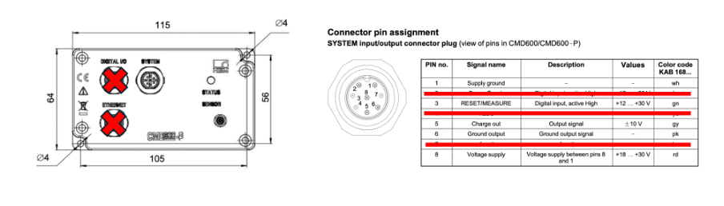

# EN 61326‑1 Test Plan  

*For Charge Amplifier Board*

---

## 1  Scope and Purpose

- Test the charge‑amplifier box against the **EN 61326‑1** standard.

## 3  Equipment Under Test (EUT)

### 3.1  Composition and Assembly

- Single hardware variant; no modifications required during test  
- No software; analogue front‑end with dual‑rail switching supply (≤ 30 mA draw)  
- PCB enclosed in a metal “jiffy” box with exposed **M12** connectors:  
  - 24 V DC power, reset input, analogue output (active)  
  - Auxiliary **M12** & Ethernet connectors (stubs / no connection)  
- **UNF‑32** coax connector for force‑washer sensor (or 3 m coax + sensor).  
  - ESD applied to shield (exposed port) – protected by TVS at the port  

### 3.2  I/O Description & Cabling Diagram

**Figure 1 – Equivalent pins (crossed‑out ports are unused)**

| Port | Cable | Notes |
|------|-------|-------|
| **System** | 3 m 8‑pin M12 | 24 V DC power supplied through cable |
| **Sensor** | 3 m coax (UNF‑32) | Shield & force‑washer metal are EMC ports (driven shield) |

### 3.3  Auxiliary Equipment

- Piezo force washer (or equivalent)  
- Oscilloscope / waveform recorder for immunity tests  
- CDS box (if required) for end‑to‑end collision detection; otherwise oscilloscope on accumulated charge

### 3.4  Relevant Classifications

| Standard | Rating | Justification |
|----------|--------|---------------|
| CISPR 11 | **Class A** | Heavy‑haul locomotive; not domestic |
| CISPR 11 | **Group 1** | No intentional RF radiation |
| CISPR 11 | **DC operating frequency** | No system clocks |

## 4  Operating Modes & Software

### 4.1  Test Mode

- Internal “test‑only” MCU captures analogue output while a **charge calibrator** injects known charges.  
- MCU UART (RX/TX) exposed on auxiliary GPIO connector for performance checks.

### 4.2  Normal Operation

- Test MCU disabled; analogue output is passed straight through.  
- No signals present on auxiliary GPIO connector.

## 5  Environmental Conditions

- **40 °C**, **80 – 100 % RH** (Pilbara region).

## 6  Performance Criteria

### 6.1  Criteria A

Device must operate normally **during** the disturbance.  
Measurement method: for each 1‑minute window the charge calibrator cycles reference charges; mean ± σ of analogue output must match pre‑test values.

### 6.2  Criteria B

Device may malfunction **during** exposure but must recover automatically; post‑recovery mean ± σ must match pre‑test samples.

### 6.3 Pre-Test and Post Test Functional Checks

#### Criteria A Measurements

To measure the performance of the EUT to ensure proper function throughout the test, ensure measurements prior to test application are recorded for a 1 minute period and the data recording system (SD Card or otherwise) is being written to. After the 1 minute period prior to test start is complete, connect the computer to the EUT and extract the samples from the device. This should provide both, the means and standard deviations of the samples. Build out a histogram of the plots during test. Once complete, remove the computer and the test may be applied to the EUT. Apply for a 1 minute period OR as specified by the test regime. After the test is complete, connect the computer to extract the samples from the EUT. The samples should then be compared to the pre-test samples.

There is an expectation that multiple peaks in the histogram exist. Each sampled distribution should be compared to the pre-test samples using a statistical test. The following tests are recommended. Extract the samples from the EUT and apply the wassersteing distance to compare the pre-test samples and the post test samples. If the wasserstein distance is less than 0.1, then the samples are considered to be similar. If the distance is greater than 0.1, then the samples are considered to be different.

TODO: confirm that 0.1 is a good asserstein distance value

#### Criteria B Measurements

Same as criteria A but only test before and after the test. Expectation is that the wasserstein distance is less than 0.1. If the distance is greater than 0.1, then the samples are considered to be different.

## 7  Top‑Level EMC Test Schedule

| Std | Phenomenon | Port / Aspect | Level / Range | Perf. Crit. | Notes |
|-----|------------|---------------|---------------|-------------|-------|
| IEC 61000‑4‑2 | ESD (contact / air) | Enclosure & accessible metal (incl. coax shield) | ± 4 kV contact, ± 8 kV air, 10 shots/point/polarity | B | ≥ 1 s between shots; log recovery time |
| IEC 61000‑4‑3 | RF radiated | Enclosure | 10 V/m (80 MHz–1 GHz), 3 V/m (1.4–2 GHz), 1 V/m (2–2.7 GHz), 80 % AM @ 1 kHz | A | 1 % step, ≥ 3 s dwell |
| IEC 61000‑4‑8 | Power‑frequency magnetic | Enclosure | 30 A/m continuous | A | Test all three axes |
| IEC 61000‑4‑4 | EFT/Burst | DC power | 2 kV, 5/50 ns, 5 kHz, 15 ms/300 ms | B | CDN; 1 min / polarity |
| IEC 61000‑4‑5 | Surge | DC power | 1 kV Line to Ground | B | CWG + CDN, 5 shots each |
| IEC 61000‑4‑6 | Conducted RF | DC power & I/O | 3 V rms 150 kHz–80 MHz, 80 % AM @ 1 kHz | A | CDN / EM clamp |
| IEC 61000‑4‑4 | EFT/Burst | I/O (system, sensor shield) | 1 kV | B | Capacitive clamp |
| IEC 61000‑4‑5 | Surge | I/O (> 3 m cables) | 1 kV Line to Ground | B | Omited with justification |
| CISPR 11 | Conducted emissions | DC power | 150 kHz–30 MHz, Class A (QP & Avg) | n/a | LISN 5 µH/50 Ω |
| CISPR 11 | Radiated emissions | Enclosure | 30 MHz–1 GHz, Class A Group 1 | n/a | 3 m SAC / OPA |

## 8  Deviations & Omitted Tests

| Type | Standard / Ref. | Justification |
|------|-----------------|---------------|
| **AC Power** | All | Device powered solely from 24 V DC |
| **Power Ctrl I/O** | All | Device has no power‑control lines |

## 9  Detailed EUT Tests

### 9.1  Enclosure ESD (IEC 61000‑4‑2)

#### 9.1.1  Equipment

| Description | Supplier |
|-------------|----------|
| 24 V DC Supply | External |
| Oscilloscope | External |
| Charge Reference Tool | Internal |
| System Test Harness | Internal |
| Sensitivity Measurement Tool | Internal |

#### 9.1.3  Locations

| IDX | Location |
|---|----------|
| 1 | Housing top |
| 2 | Connector collars |
| 3 | System pins 1, 3, 5, 6, 8 |
| 4 | Force‑washer housing |

#### 9.1.4  Setup

- Apply ESD to EUT in anechoic chamber.
- DAQ and Simulator housings to be bonded to chamber ground;
- DAQ and Simulator measurements to be made prior to ESD application.
- DAQ and Simulator to be connected to the EUT after ESD application and measurements to begin 1 minute after ESD application.

#### 9.1.5  Procedure

- Follow IEC 61000‑4‑2 test method.

#### 9.1.6  Performance

- Criteria B: No change in analogue output 1 minute after exposure.

### 9.2  Enclosure RF (IEC 61000‑4‑3)

#### 9.2.1  Equipment

- 24 V DC supply (external)  
- Battery‑powered data‑collection module (internal)  
- Battery‑powered charge simulator (internal)

#### 9.2.2  Setup

- Apply RF to EUT in anechoic chamber.  
- DAQ & simulator housings bonded to chamber ground; sensor‑coax shield isolated from housing until entry.

#### 9.2.3  Procedure

- Follow IEC 61000‑4‑3 test method.

#### 9.2.4  Performance

- Criteria A: No change in analog output during exposure.

### 9.3  Power‑frequency Magnetic (IEC 61000‑4‑8)

#### 9.3.1  Equipment

- 24 V DC supply (external)  
- Battery‑powered data‑collection module (internal)  
- Battery‑powered charge simulator (internal)

#### 9.3.2  Setup

- Apply magnetic field to EUT in anechoic chamber.
- DAQ & simulator housings bonded to chamber ground; sensor‑coax shield isolated from housing until entry.
- DAQ and Simulator to be connected to the EUT after magnetic field application and measurements to begin 1 minute after magnetic field application.
- DAQ and Simulator measurements to be made throughout the test. Recordings to be saved to SD Card for analysis instantly after test.

#### 9.3.3  Procedure

- Follow IEC 61000‑4‑8 test method.

#### 9.3.4  Performance

- Criteria A: No change in analog output during exposure.

### 9.4  EFT/Burst (IEC 61000‑4‑4)

#### 9.4.1  Equipment

- 24 V DC supply (external)  
- Battery‑powered data‑collection module (internal)  
- Battery‑powered charge simulator (internal)

#### 9.4.2  Setup

- Apply EFT/Burst to EUT in anechoic chamber.
- DAQ and Simulator housings bonded to chamber ground; sensor‑coax shield isolated from housing until entry.
- DAQ and Simulator to be connected to the EUT after EFT/Burst application and measurements to begin 1 minute after EFT/Burst application.
- DAQ and Simulator measurements to be made throughout the test. Recordings to be saved to SD Card for analysis instantly after test.

#### 9.4.3  Procedure

- Follow IEC 61000‑4‑4 test method.

#### 9.4.4  Performance

- Criteria A: No change in analog output during exposure.

### 9.5  DC Power and IO Surge (IEC 61000‑4‑5)

#### 9.5.1 Equipment

- 24 V DC supply (external)  
- Battery‑powered data‑collection module (internal)  
- Battery‑powered charge simulator (internal)

#### 9.5.2 Test Specifications

- Test Level 2 - 1kV Line to Line
- Number of Impulses:DC Power: 5 Postive & 5 Negative
- Time Between Successive Pulses: 1 Minute of Less
- Apply to all SYS Ports (Pins 1-8). Includes both, IO and DC Power

#### 9.5.3  Procedure

- Follow IEC 61000‑4‑5 test method.

#### 9.5.4  Performance

- Criteria B: No change in analogue output 1 minute after exposure.

### 9.6  Conducted RF (IEC 61000‑4‑6)

#### 9.6.1  Equipment

- 24 V DC supply (external)  
- Battery‑powered data‑collection module (internal)  
- Battery‑powered charge simulator (internal)

#### 9.6.2  Setup

- Apply conducted RF to EUT in anechoic chamber.
- DAQ and Simulator housings bonded to chamber ground; sensor‑coax shield isolated from housing until entry.
- DAQ and Simulator to be connected to the EUT throughout the test.
- DAQ and Simulator measurements to be made throughout the test. Recordings to be saved to SD Card for analysis instantly after test.

#### 9.6.3  Procedure

- Follow IEC 61000‑4‑6 test method.

#### 9.6.4  Performance

- Criteria A: No change in analog output during exposure.

### 9.7  I/O EFT/Burst (IEC 61000‑4‑4)

#### 9.7.1  Equipment

- 24 V DC supply (external)
- Battery‑powered data‑collection module (internal)
- Battery‑powered charge simulator (internal)

#### 9.7.2  Setup

- Apply EFT/Burst to I/O in anechoic chamber.
- DAQ and Simulator housings bonded to chamber ground; sensor‑coax shield isolated from housing until entry.
- DAQ and Simulator to be connected to the EUT after EFT/Burst application and measurements to begin 1 minute after EFT/Burst application.
- DAQ and Simulator measurements to be made throughout the test. Recordings to be saved to SD Card for analysis instantly after test

#### 9.7.3  Procedure

- Follow IEC 61000‑4‑4 test method.

#### 9.7.4  Performance

- Criteria B: No change in analogue output 1 minute after exposure.

### 9.8  I/O Surge (IEC 61000‑4‑5)

#### 9.8.1  Equipment

- 24 V DC supply (external)
- Battery‑powered data‑collection module (internal)
- Battery‑powered charge simulator (internal)

#### 9.8.2  Setup

- Apply surge to I/O in anechoic chamber.
- DAQ and Simulator housings bonded to chamber ground; sensor‑coax shield isolated from housing until entry.
- DAQ and Simulator to be connected to the EUT after surge application and measurements to begin 1 minute after surge application.
- DAQ and Simulator measurements to be made at each phase of the test - prior to test and after test. Recordings to be saved to SD Card for analysis instantly after test.

#### 9.8.3  Procedure

- Follow IEC 61000‑4‑5 test method.

#### 9.8.4  Performance

- Criteria B: No change in analogue output 1 minute after exposure.

### 9.9  Conducted Emissions (CISPR 11)

#### 9.9.1  Equipment

- 24 V DC supply (external)
- Battery‑powered data‑collection module (internal)
- Battery‑powered charge simulator (internal)

#### 9.9.2  Setup

- Connect EUT to LISN and spectrum analyser.
- DAQ and Simulator housings bonded to chamber ground; sensor‑coax shield isolated from housing until entry.
- DAQ and Simulator to be connected to the EUT after conducted emissions application and measurements to begin 1 minute after conducted emissions application.
- DAQ and Simulator measurements to be made throughout the test. Recordings to be saved to SD Card for analysis instantly after test.

#### 9.9.3  Procedure

- Follow CISPR 11 test method.

#### 9.9.4  Performance

- Device must meet Class A limits for conducted emissions.

### 9.10  Radiated Emissions (CISPR 11)

#### 9.10.1  Equipment

- 24 V DC supply (external)
- Battery‑powered data‑collection module (internal)
- Battery‑powered charge simulator (internal)

#### 9.10.2  Setup

- Place EUT on turntable in anechoic chamber.
- DAQ and Simulator housings bonded to chamber ground; sensor‑coax shield isolated from housing until entry.
- DAQ and Simulator to be connected to the EUT after radiated emissions application and measurements to begin 1 minute after radiated emissions application.
- DAQ and Simulator measurements to be made throughout the test. Recordings to be saved to SD Card for analysis instantly after test

#### 9.10.3  Procedure

- Follow CISPR 11 test method.
- Rotate EUT in the horizontal plance 90° and measure radiated emissions at each angle.
- Rotate EUT in the vertical plance 90° and measure radiated emissions at each angle.

#### 9.10.4  Performance

- Device must meet Class A Group 1 limits for radiated emissions.
